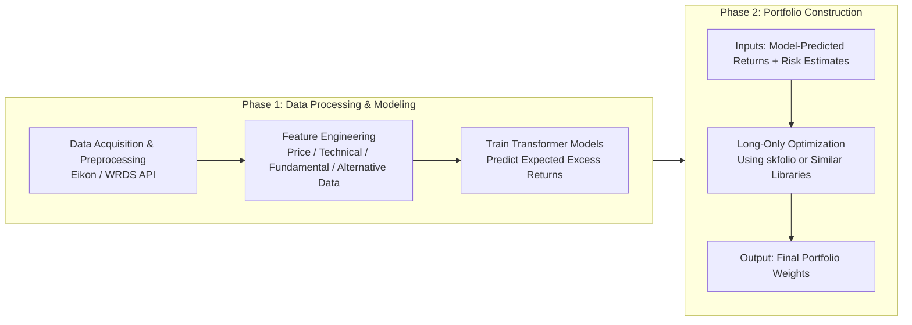

```mermaid
flowchart LR
    subgraph A[Phase 1: Data Processing & Modeling]
        direction LR
        A1[Data Acquisition & Preprocessing<br>Eikon / WRDS API] --> A2[Feature Engineering<br>Price / Technical / Fundamental / Alternative Data]
        A2 --> A3[Train Transformer Models<br>Predict Expected Excess Returns]
    end

    subgraph B[Phase 2: Portfolio Construction]
        B1[Inputs: Model-Predicted Returns + Risk Estimates] --> B2[Long-Only Optimization<br>Using skfolio or Similar Libraries]
        B2 --> B3[Output: Final Portfolio Weights]
    end

    A --> B
```
